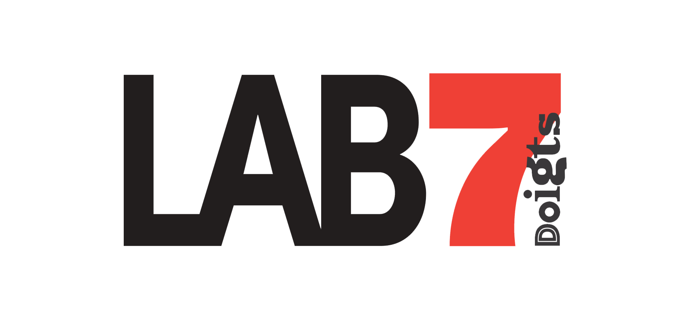

  <h1>🎨 koaia </h1>
  

    
    
     
    
    
  

A GUI tool for exploring Generative AI. Create custom visual effects by combining input layers, filters, and real-time Stable Diffusion, with a live preview and NDI streaming output.

## Features

- 📷 Camera, video, filter, and shape mask input layers
- ✍️ Prompt builder with real-time parameter control
- 👁️ Live visual feedback and layering preview
- 📡 NDI streaming output

## Workflow

Start by adding input layers—load a video file or connect a camera. Apply filters like Voronoi or Smoke shaders, or add shape masks (triangle, circle, rectangle) to define regions. Use the prompt builder to write prompts and adjust Stable Diffusion parameters such as seed, steps, and size. Save and load presets to capture your current state. Finally, preview your generated output and stream via NDI to external applications.

## Credits

Developed by the [Société des Arts Technologiques](https://sat.qc.ca), built on [ossia score](https://ossia.io), in collaboration with [LAB7](https://7doigts.com/lab).

  
  
  

