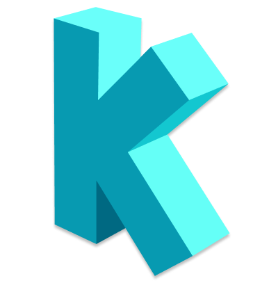
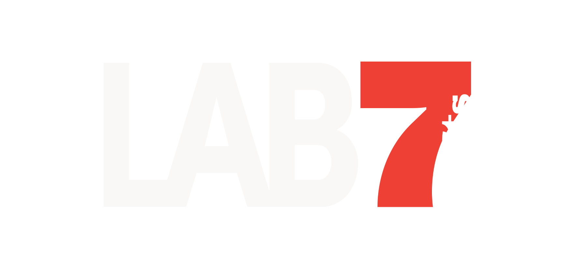

  

  

    
    
     
    
    
  

Koaia is a GUI for exploring generative AI. Create custom visual effects by combining input layers, filters, and real-time generative AI models, with a live preview.

## Features

- 📷 Camera, video, filter, and shape mask input layers
- ✍️ Prompt builder with real-time parameter control
- 👁️ Live visual feedback and layering preview
- 📡 NDI/syphon/spout streaming input and output (coming soon!)

## Credits

Developed by the [Société des Arts Technologiques](https://sat.qc.ca), built on [ossia score](https://ossia.io), in collaboration with [LAB7](https://7doigts.com/lab).

  
  
  

