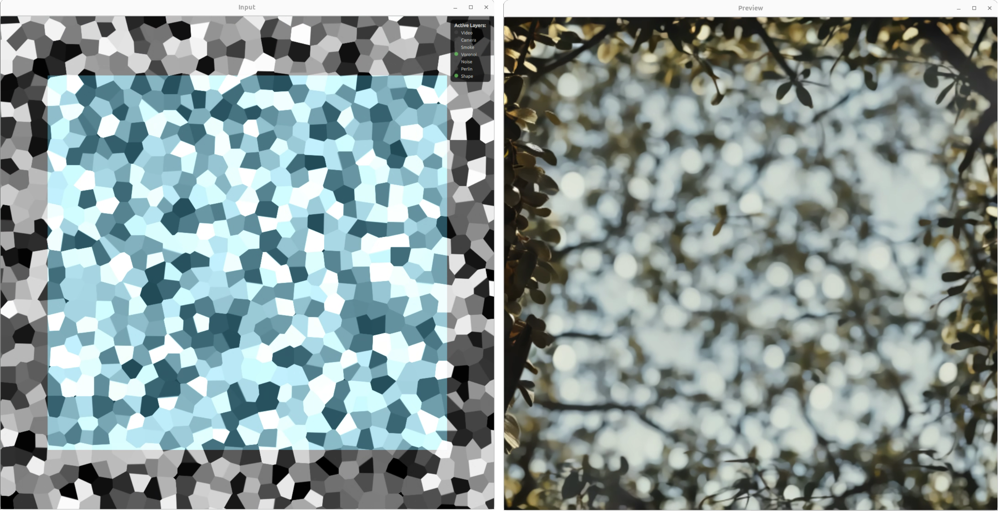
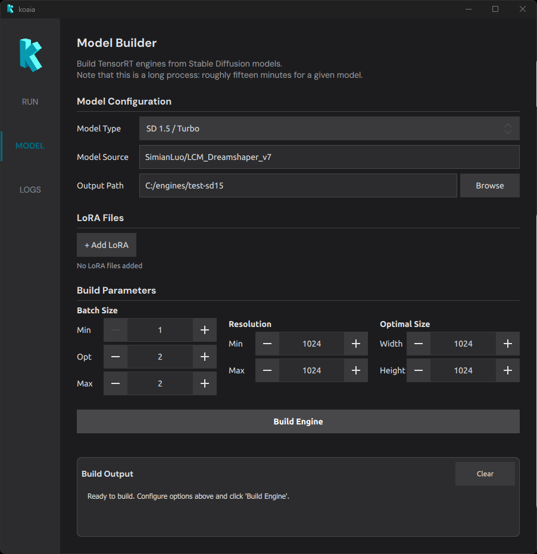
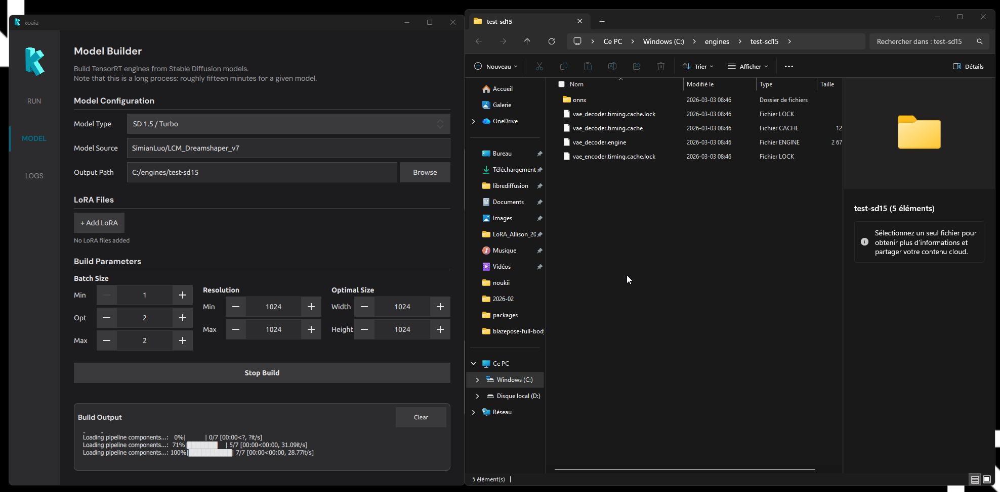

# Usage

The sidebar allows you to toggle between the active generation environment, the backend model configuration, and logger that will log debugging messages.

## The **RUN** tab

This is where you manipulate live parameters to generate visuals.

- [Input](#input)
- [AI model](#ai-model)
- [Noise layer](#noise-layer)
- [Shape layer](#shape-layer)
- [Preview windows](#preview-windows)

### Input
- **Video** : Load a video file as an input layer. Use the amount slider to blend it with the composition.
- **Camera** : Use a connected camera as input. Use the amount slider to control its visibility in the mix.

### AI model
- **Prompt** : Text prompt that drives the generative model.
- **Workflow** : Choose the inference workflow (e.g. which pipeline to run).
- **Engine** : Path to the folder containing the model/engine files.
- **Seed** : Random seed for reproducible results.
- **Timesteps** : Number of denoising steps (e.g. 20).
- **Guidance** : Guidance level and type for the model (?)
- **Resolution** : Output size (e.g. preset dimensions).
- **Options** : Denoising batch, add noise, manual mode, etc., depending on the workflow.

### Noise layer

Add procedural or shader-based layers to the composition:

- **Shader type** : Choose a noise or effect (e.g. Voronoi, Smoke, Noise, Perlin).
- **Amount sliders** : Control the strength of each effect (Smoke, Voronoi, Noise, Perlin) in the mix.

### Shape layer

Define mask regions with shapes:

- **Shape type** : Triangle, circle, rectangle, etc.
- **Amount** : How much the shape affects the composition.
- **Brightness / Hue** : Appearance of the shape.
- **Position** : X and Y to place the shape.
- **Invert** : Invert the shape mask.

### Preview windows

The main view shows the live result of all layers and the AI output. Use it to tune parameters in real time. The **Input** window shows the combined mask (e.g. Voronoi + shape); the **Preview** window shows the final rendered result.

## The **BUILD** tab

The BUILD tab converts Stable Diffusion models into optimized TensorRT engines that can run in real time on your NVIDIA GPU. This is a one-time build step: once an engine is built, it can be loaded from the RUN tab for live generation.

Building an engine takes between ten and thirty minutes depending on the machine and / or model.

- [Model Configuration](#model-configuration)
- [LoRA Files](#lora-files)
- [Build Parameters](#build-parameters)
- [Understanding batch size](#understanding-batch-size)
- [Understanding resolution](#understanding-resolution)
- [Build Output](#build-output)

### Model Configuration

- **Model Type** : Choose the Stable Diffusion architecture.
  - *SD 1.5 / Turbo* : Requires at least 8 GB of VRAM. Lighter and faster to build.
  - *SDXL* : Requires at least 12 GB of VRAM. Produces higher-quality images but is heavier.
- **Model Source** : A HuggingFace model identifier (e.g. `SimianLuo/LCM_Dreamshaper_v7`) or a local path to a model directory. The model will be downloaded automatically if it is not already cached.
- **Output Path** : The folder where the built engine files will be saved. This is the path you will later point to from the **Engine** field in the RUN tab.

Note that to build SDXL, you currently need to clone the following repository: https://huggingface.co/stabilityai/sdxl-turbo-tensorrt and point Koaia to its folder.

### LoRA Files

LoRA (Low-Rank Adaptation) weights are small add-on files that specialize a base model toward a particular style or subject. They are merged into the model at build time.

- Click **+ Add LoRA** to add a LoRA file (`.safetensors` format).
- Each LoRA has an individual **Weight** (0.00 -- 2.00) that controls how strongly it influences the output.
- When one or more LoRAs are present, a **Global Scale** slider (0.00 -- 5.00) lets you scale the combined LoRA effect.

### Build Parameters

These parameters define the *optimization profile* of the TensorRT engine. TensorRT compiles the model for a range of possible batch sizes and resolutions; inputs within this range will run efficiently, while the *optimal* values receive the most aggressive optimization.

It gives better FPS to have a model which is as constrained as possible, for instance it is more efficient to have separate models for 512x512 and 1024x1024. The build time is overall longer, but the performance is worth it!

#### Batch Size

The batch size determines how many images the engine processes in a single forward pass.

- **Min Batch** : The smallest batch the engine will accept (default: 1).
- **Opt Batch** : The batch size TensorRT optimizes for most aggressively (default: 2).
- **Max Batch** : The largest batch the engine will accept (default: 2).

#### Understanding batch size

Batch size has a direct impact on what the engine can do at inference time:

- **Batch size 1** : The engine runs one denoising step per pass. Negative prompts are **not supported** because there is no room for the unconditional (negative) pass in the same batch. This is the fastest option for simple prompt-only generation.
- **Batch size 2** : The engine can process two images per pass, which enables **negative prompt support** (one slot for the positive prompt, one for the negative). This is the recommended default for most workflows.
- **Higher batch sizes** : Allow more denoising steps or parallel generations per pass, at the cost of higher VRAM usage and potentially lower throughput per image.

For instance, a max batch of 4 will allow either to run 4-steps inference with batch denoising, or two steps if a negative prompt is desired (enabled by CFG -- classifier-free guidance in *Full* mode).

#### Resolution

- **Min Resolution** : The smallest square resolution the engine supports (default: 1024, step: 64 px).
- **Max Resolution** : The largest square resolution the engine supports (default: 1024, step: 64 px).

#### Optimal Size

- **Optimal Width / Height** : The resolution TensorRT will optimize for most aggressively. This should match the resolution you intend to use most often during generation.

#### Understanding resolution

The resolution range and optimal size have a significant impact on performance and VRAM consumption:

- **Higher resolutions cost more** : VRAM usage and computation time scale roughly with the number of pixels. Doubling the resolution in each dimension (e.g. 512 to 1024) quadruples the pixel count. If real-time performance is important, prefer lower resolutions such as 512x512 for SD 1.5 or 1024x1024 for SDXL.
- **Wider ranges are less efficient** : If the min and max resolution are far apart, TensorRT has to produce a more generic engine. Setting min and max to the same value (a fixed profile) yields the most efficient engine for that resolution.
- **Match the optimal size to your use case** : The optimal width/height should correspond to the resolution you will select in the RUN tab. Mismatches between the optimal profile and the actual inference resolution will degrade performance.

### Build Output

The bottom panel shows live log output from the build process. It displays environment synchronization messages followed by the TensorRT compilation progress. When the build finishes successfully, the output folder opens automatically.
If you encounter a problem, copy this log and send it to us!
