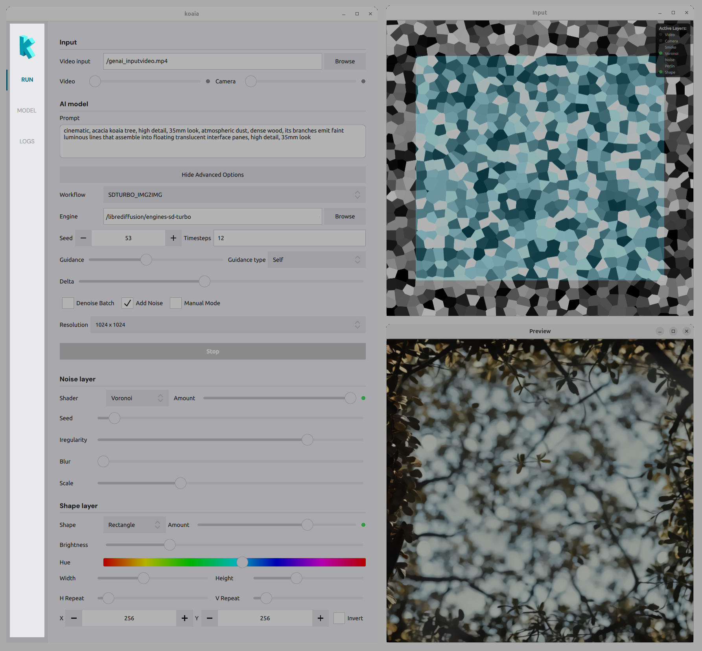
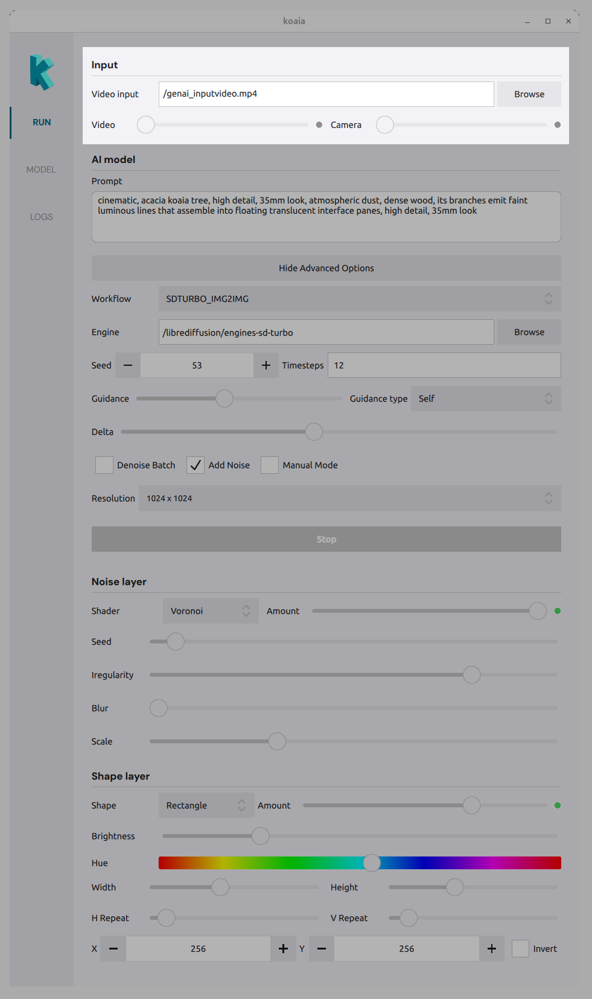
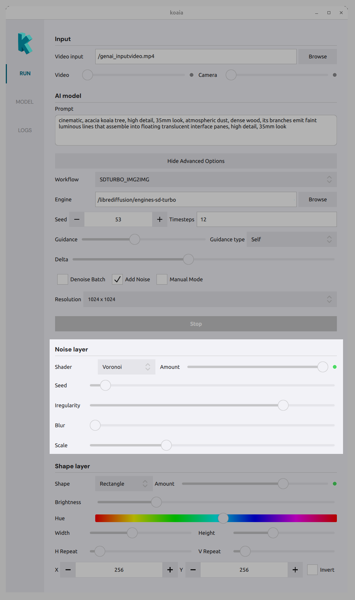
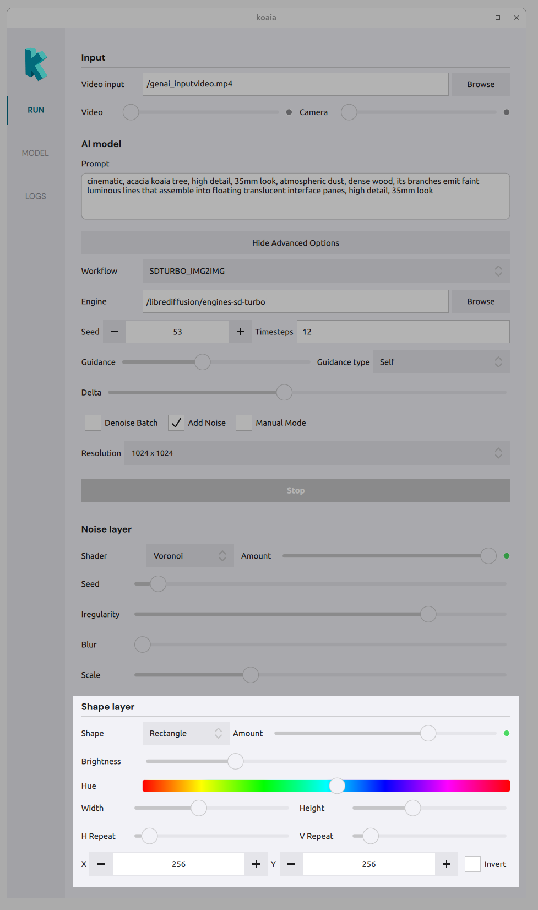

# Usage

The sidebar allows you to toggle between the active generation environment, the backend model configuration, and logger that will log debugging messages. 

## The **RUN** tab

This is where you manipulate live parameters to generate visuals. 

- [Input](#input)
- [AI model](#ai-model)
- [Noise layer](#noise-layer)
- [Shape layer](#shape-layer)
- [Preview windows](#preview-windows)

### Input
- **Video** : Load a video file as an input layer. Use the amount slider to blend it with the composition.
- **Camera** : Use a connected camera as input. Use the amount slider to control its visibility in the mix.

### AI model
- **Prompt** : Text prompt that drives the generative model.
- **Workflow** : Choose the inference workflow (e.g. which pipeline to run).
- **Engine** : Path to the folder containing the model/engine files.
- **Seed** : Random seed for reproducible results.
- **Timesteps** : Number of denoising steps (e.g. 20).
- **Guidance** : Guidance level and type for the model (?)
- **Resolution** : Output size (e.g. preset dimensions).
- **Options** : Denoising batch, add noise, manual mode, etc., depending on the workflow.

### Noise layer

Add procedural or shader-based layers to the composition:

- **Shader type** : Choose a noise or effect (e.g. Voronoi, Smoke, Noise, Perlin).
- **Amount sliders** : Control the strength of each effect (Smoke, Voronoi, Noise, Perlin) in the mix.

### Shape layer

Define mask regions with shapes:

- **Shape type** : Triangle, circle, rectangle, etc.
- **Amount** : How much the shape affects the composition.
- **Brightness / Hue** : Appearance of the shape.
- **Position** : X and Y to place the shape.
- **Invert** : Invert the shape mask.

### Preview windows

The main view shows the live result of all layers and the AI output. Use it to tune parameters in real time. The **Input** window shows the combined mask (e.g. Voronoi + shape); the **Preview** window shows the final rendered result.

## The **MODEL** tab 
- Build engines from Stable Diffusion models locally (e.g., SD 1.5, SD Turbo) 
- Option to add your custom trained LoRA.

## The **LOG** tab
